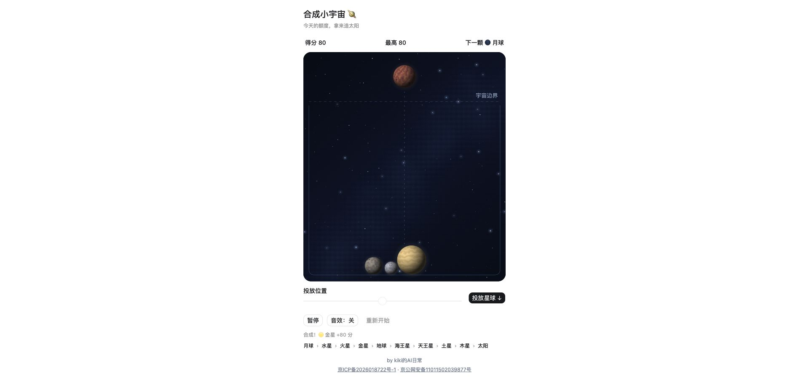

# 合成小宇宙 🪐

在星空里拖动月球与八大行星，一路合成太阳。纯静态单文件网页，打开 `dist/index.html` 就能玩。

网站地址：<https://merge.games.kikiaigc.com/>



## 玩法

点击空白投放，按住星球可以自由拖动，同款碰到就合成。合成顺序：

> 月球 › 水星 › 火星 › 金星 › 地球 › 海王星 › 天王星 › 土星 › 木星 › 太阳

- **一次 1 颗 / 3 颗**：可切换单发与三连发。冷却时间不变，所以三连发是「一次顶三次」，盘面填充速度和连投三次一样 —— 更快但不更难。
- **复活**：每局一次。先把全场同级的星球两两合并（出分、出连锁），再从最小的星球开始清扫，直到盘面降回警戒线以下；海王星及以上不动。
- 合成出太阳会触发满屏星光与庆祝音阶，之后可以继续冲分。
- 最高分与投放模式存在浏览器本地，不上传。

## 目录

- `src/game.html`：游戏逻辑、布局与样式
- `src/site.css`：整站深色主题
- `src/celebration.js`：合成太阳的全屏庆祝效果
- `build.py`：把 `src/` 与页面骨架合并成单文件 `dist/index.html`
- `dist/index.html`：构建产物，可直接部署
- `previous-index.html`：初版页面，`build.py` 从中沿用 head 与页脚

## 构建

```bash
python3 build.py
```

构建是可复现的：同样的输入产出同样的字节。

## Contributors

两个 AI 接力完成：

- **Codex（GPT-6 Astra）** — 游戏本体、深色主题、初次上线
- **云璟（Claude Opus 5）** — 三连发、复活、移动端修复、一键部署

本仓库不包含服务器凭据、证书或部署指南。

---

by [kiki的AI日常](https://merge.games.kikiaigc.com/)
